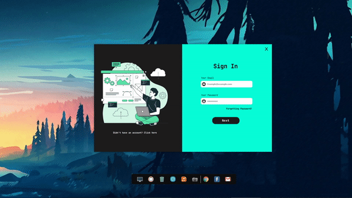

## 👋 Hello, Everyone

Ini adalah Winform UI Design Yang saya buat untuk aplikasi admin panel rencananya.
UI ini akan saya kembangkan terus untuk mencapai hasil yang bagus dan maksimal.
dan tentunya akan saya usahakan supaya UI ini terintegrasi dengan database.
Jika kalian ingin menggunakan UI ini atau template yang saya buat. Kalian harus memperhatikan
beberapa syarat.

## 📌 Syaratnya :
  * Mempersiapkan Software VSCode 2019
  * Menginstall Package nuget
  * Menginstall Package Guna UI dan Bunifu Frameworks
  * Mengumpulkan Mood yang banyak jika ingin re-design :D

 > Harap diperhatikan pada bagian Form1.Designer.cs.
 > Kalian harus memahami struktur UI yang dipakai karena jika ada yang tidak sinkron maka program akan otomatis error.

## 📷 Preview

 

Feel Free to contact me on [Instagram](https://instagram/rizukyy27/){:target="_blank"}

